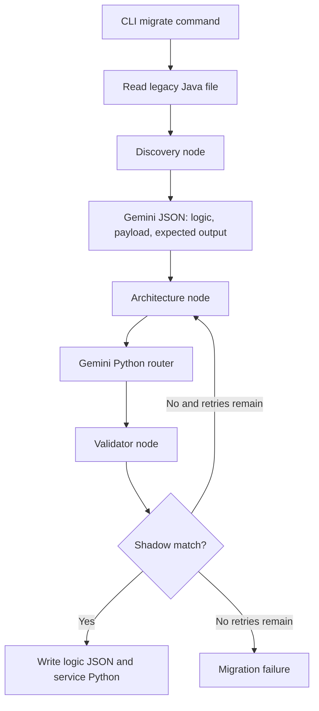

# Project Rosetta - Implementation To Date

**Project:** Rosetta legacy modernization toolkit  
**Implementation snapshot:** 2026-08-22  
**Workspace:** `rosetta-workspace/rosetta`

## 1. Executive Summary

Rosetta is currently implemented as a Python-based migration prototype for converting legacy Java/OFBiz business logic into an async FastAPI service. The implemented workflow accepts a Java source file and target method, asks a Gemini-powered Discovery step to describe the business behavior and generate a test fixture, asks an Architecture step to generate a FastAPI router, then dynamically loads and exercises the generated service in a shadow validation step.

The current repository contains three useful layers:

1. **Active migration pipeline:** `rosetta-cli/rosetta.py` -> `rosetta-engine/core/graph.py` -> `rosetta-engine/core/agents.py`.
2. **Supporting analysis tooling:** `rosetta-engine/parsers/ast_ingester.py` and the JSON framework rules under `rules/`.
3. **Demonstration runtime:** `modern-invoices/`, `gateway.py`, `modern-invoices/main.py`, and `dashboard/data/roadmap_graph.json`.

The prototype has already demonstrated a concrete invoice-total migration artifact. The generated service calculates subtotals, shipping, tax, adjustments, and a grand total using typed Pydantic request/response models and `Decimal` arithmetic. The most important unfinished integration is that AST/Neo4j ingestion and the generated OpenAPI output are not currently connected to the active CLI migration write path.

## 2. Implemented Architecture



The active graph is assembled in `rosetta-engine/core/graph.py`:

```text
START
  -> discovery_agent
  -> architecture_agent
  -> validator
  -> END                         when validation passes
  -> architecture_agent          when validation fails and retry_count < 3
  -> END                         when retry_count >= 3
```

This is a three-node graph with a bounded self-correction loop. The older implementation under `rosetta-engine/agents/` is a separate two-node prototype and is not imported by the active CLI.

## 3. Active Components

### 3.1 CLI

File: [rosetta-cli/rosetta.py](rosetta-cli/rosetta.py)

The CLI currently exposes two commands.

#### `migrate`

Arguments:

- `--file`: path to the legacy Java file.
- `--target`: target method name.
- `--output`: output directory, defaulting to `./modern-invoices`.

Behavior:

1. Adds `rosetta-engine` to `sys.path`.
2. Imports the compiled `rosetta_pipeline` from `core.graph`.
3. Reads the complete Java file as UTF-8 text.
4. Initializes `RosettaState` with empty test and validation fields.
5. Invokes the LangGraph pipeline.
6. Stops without writing artifacts if shadow validation fails.
7. Writes `<target>_logic.json` and `<target>_service.py` after validation succeeds.
8. Creates an output-level `main.py` wrapper if one does not already exist.

#### `plan`

Arguments:

- `--dir`: root directory to scan.
- `--output`: output directory, defaulting to `./dashboard/data`.

Behavior:

1. Recursively discovers Java files.
2. Limits the prompt input to the first 100 relative paths.
3. Sends the file tree to Gemini.
4. Requests graph-shaped JSON containing `nodes` and `edges`.
5. Writes `roadmap_graph.json` for a React/Force Graph-style visualization.

The `plan` command currently produces a model-generated roadmap graph. It does not populate Neo4j.

### 3.2 Shared active state

File: [rosetta-engine/core/state.py](rosetta-engine/core/state.py)

`RosettaState` carries:

| Field | Purpose |
|---|---|
| `file_path` | Original legacy source path. |
| `target_method` | Method selected for migration and validator artifact naming. |
| `java_code` | Complete source text passed to Discovery. |
| `logic_json` | Discovery output serialized as JSON text. |
| `generated_python` | Architecture output containing the FastAPI router. |
| `openapi_spec` | Reserved state field for an OpenAPI result; not populated by the active Architecture node. |
| `candidate_source` | Generated Python source executed by the validator before artifact writing. |
| `candidate_route` | Optional route contract used to select the endpoint under test. |
| `candidate_method` | HTTP method used by the validator, defaulting to `POST`. |
| `test_payload` | Backward-compatible primary request fixture. |
| `expected_legacy_output` | Discovery-generated baseline response. |
| `test_cases` | Canonical parity cases evaluated by the validator. |
| `baseline_mode` | Baseline authority: `provisional`, `approved`, or `java_executed`. |
| `baseline_command` | External adapter command used for Java-executed baselines. |
| `validation_results` | Per-case normalized outputs and differences. |
| `validation_passed` | Shadow-test result. |
| `validation_feedback` | Failure detail sent to a retrying Architecture step. |
| `retry_count` | Bounded retry counter. |

### 3.3 Discovery node

File: [rosetta-engine/core/agents.py](rosetta-engine/core/agents.py)

`discovery_node` uses `ChatGoogleGenerativeAI` with model `gemini-3.6-flash` and low temperature (`0.1`). Its prompt requests a JSON object containing:

- `logic`: textual business-rule description.
- `schema_keys`: important incoming payload keys.
- `test_payload`: realistic input JSON.
- `expected_output`: expected JSON response for that payload.

The result is extracted from a fenced JSON block by `extract_code_block`, parsed using `json.loads`, and stored in `logic_json`. The generated test payload and expected output are copied into state for validation.

The helper also handles LangChain responses represented as lists of text-like blocks. If no matching fenced block is found, it attempts to parse the complete response text.

### 3.4 Architecture node

File: [rosetta-engine/core/agents.py](rosetta-engine/core/agents.py)

`architecture_node` uses the same Gemini model to convert Discovery JSON into Python source. The prompt enforces:

- `APIRouter(tags=["Generated Service"])`.
- No standalone `FastAPI` application.
- Pydantic request models.
- Async route handlers.
- Iteration over list fields when calculating totals.
- Real numeric calculations rather than hardcoded zero responses.

When validation feedback exists, it is included in the next prompt as a correction trace. The node increments `retry_count` and returns generated Python source in `generated_python`.

The active node does not create or populate `openapi_spec`, despite that field existing in state and despite the older Architecture Agent defining an OpenAPI artifact schema.

### 3.5 Shadow validator

File: [rosetta-engine/core/validator.py](rosetta-engine/core/validator.py)

The validator provides the prototype's parity mechanism:

1. Reads the generated source from `candidate_source`/`generated_python` in state.
2. Compiles it into an isolated in-memory module.
3. Creates an in-memory FastAPI application and includes the module's `router`.
4. Selects `candidate_route`; if none is supplied, it allows only a single generated route.
5. Sends the explicit `candidate_method` request through FastAPI `TestClient`.
6. Normalizes key naming and monetary transport representations before comparison.
7. Runs every canonical case and returns structured field-level mismatch feedback to Architecture.

Baseline authority is controlled by `baseline_mode`:

- `provisional`: use the expected output returned by Discovery; development-only.
- `approved`: use a reviewed expected output stored with the case; suitable for a controlled demo.
- `java_executed`: invoke `baseline_command` for every case and use the actual legacy adapter response; required for true parity certification.

The external adapter protocol is documented in [rosetta-engine/baselines/README.md](rosetta-engine/baselines/README.md).

The validator prints a side-by-side report containing the input, expected Java baseline, and actual Python response. Comparison logic lives in [rosetta-engine/core/equivalence.py](rosetta-engine/core/equivalence.py): representation-only differences such as camelCase versus snake_case or `130.4` versus `"130.40"` are accepted, while missing fields and real monetary differences remain failures.

### 3.6 Generated service host

File: [modern-invoices/main.py](modern-invoices/main.py)

The generated host creates a FastAPI app on port `8001`, scans its own directory for files ending in `_service.py`, dynamically imports them, and mounts any exposed `router`. It also exposes `GET /health` with an operational status response.

This allows multiple generated routers to share one domain service process without manually editing the host for every migration.

### 3.7 Gateway

File: [gateway.py](gateway.py)

The gateway creates a FastAPI app on port `8000` and routes API traffic by path:

- `/api/v1/legacy/{path}` returns a mocked legacy-monolith response and Tomcat-like header.
- `/api/v1/{path}` proxies requests to the modern service at `http://localhost:8001` using `httpx.AsyncClient`.

The explicit legacy route is registered before the modern catch-all route. Modern-service request failures are translated into HTTP `502` responses.

## 4. Demonstrated Invoice Migration

The current checked-in artifact is [modern-invoices/getGrandTotal_service.py](modern-invoices/getGrandTotal_service.py). It exposes:

```text
POST /calculate-grand-total
```

The service defines these models:

- `CartLineItem`: line subtotal.
- `ShipInfo`: shipping estimate and tax.
- `OrderAdjustment`: fixed or percentage adjustment, optionally associated with a ship group.
- `GrandTotalRequest`: cart lines, ship information, regular adjustments, and global adjustments.
- `GrandTotalResponse`: subtotal, shipping, tax, adjustment totals, and grand total.

The calculation is:

```text
sub_total = sum(cart_lines.item_sub_total)
total_shipping = sum(ship_info.ship_estimate)
total_sales_tax = sum(ship_info.total_tax)
grand_total = sub_total + total_shipping + total_sales_tax
              + order_other_adjustment_total
              + order_global_adjustments
```

Percentage adjustments are calculated against either the subtotal or the subtotal plus tax and shipping, depending on the adjustment category. Global adjustments are included only when `ship_group_seq_id` is absent or equals `_NA_`.

The accompanying [modern-invoices/getGrandTotal_logic.json](modern-invoices/getGrandTotal_logic.json) records the business purpose, formula, component operations, and relevant OFBiz entities:

- `OrderAdjustment`.
- `OrderItem`.
- `OrderItemShipGroup`.

The accompanying [modern-invoices/getGrandTotal_openapi.yaml](modern-invoices/getGrandTotal_openapi.yaml) documents the endpoint contract. The active CLI currently writes logic and Python artifacts, so this OpenAPI file represents an existing demonstration artifact rather than a reliably generated output of the current pipeline.

## 5. Framework Rules and AST/Neo4j Support

### 5.1 Rule files

The repository contains JSON rule definitions for:

- Apache OFBiz: [rules/ofbiz.json](rules/ofbiz.json)
- Spring Boot: [rules/spring_boot.json](rules/spring_boot.json)
- Java EE/Jakarta: `rules/java_ee.json`
- Django: `rules/django.json`
- Express/Mongoose: `rules/express_mongoose.json`

The rules describe database read patterns, write patterns, and service trigger patterns. The active CLI does not currently accept a framework argument and does not invoke the rule loader during `migrate`.

### 5.2 AST ingester

File: [rosetta-engine/parsers/ast_ingester.py](rosetta-engine/parsers/ast_ingester.py)

The `GraphIngester` abstraction connects to Neo4j and creates:

```text
(Service {name}) -[:INTERACTS_WITH {action}]-> (DatabaseTable {name})
```

`process_java_file_to_neo4j` currently:

1. Loads a framework rule file.
2. Parses Java with `javalang`.
3. Connects to Neo4j using environment variables or defaults.
4. Locates the named `MethodDeclaration`.
5. Inspects nested `MethodInvocation` nodes.
6. Matches the currently implemented method-chain read pattern.
7. Extracts literal table names and writes `READ` relationships.

The write-pattern path and annotation path are placeholders. There is also no active CLI call from `migrate` into this ingester, and no graph context is passed into the active Discovery prompt.

### 5.3 Roadmap graph data

File: [dashboard/data/roadmap_graph.json](dashboard/data/roadmap_graph.json)

The checked-in visualization data groups OFBiz Java classes into bounded-context nodes such as `OrderManagement`, `ShoppingCartManagement`, `FinancialAccounting`, and `ShippingAndFulfillment`. Edges use the `BELONGS_TO` label. This is a static/generated planning artifact and is separate from the Neo4j interaction graph.

## 6. Earlier Agent Prototype

Files:

- `rosetta-engine/agents/discovery_agent.py`
- `rosetta-engine/agents/architecture_agent.py`
- `rosetta-engine/agents/orchestrator.py`

These modules implement an earlier design:

- Discovery fetches Neo4j context and uses Pydantic `BusinessLogicPayload` structured output.
- Architecture uses Pydantic `MicroserviceArtifacts` structured output containing both FastAPI code and OpenAPI YAML.
- Orchestration is `discover -> architect -> END`.

The corresponding tests are standalone, live-LLM scripts rather than isolated deterministic unit tests:

- `rosetta-engine/agents/test_discovery_agent.py`
- `rosetta-engine/agents/test_architecture_agent.py`

Because the active CLI imports `core.graph`, these files should be treated as historical/reference implementation unless they are explicitly reconnected.

## 7. Runtime and Infrastructure

File: [docker-compose.yml](docker-compose.yml)

The compose file provisions:

- Neo4j `5.18.0` on ports `7474` and `7687`.
- PostgreSQL `15-alpine` on port `5432` for legacy/parity data.
- Persistent Docker volumes for database data and logs.

Neo4j credentials in compose are `neo4j` / `rosetta_hackathon2026`. The AST ingester defaults to a different password (`password`) when no environment value is present, so environment configuration is required for those components to agree.

File: [requirements.txt](requirements.txt)

The file is currently empty. Imports in the implementation require packages including FastAPI, Uvicorn, HTTPX, LangGraph, LangChain Google GenAI, LangChain Core, Pydantic, python-dotenv, javalang, Neo4j, and potentially SQLAlchemy/asyncpg for generated services.

## 8. How The Current Prototype Is Run

From the workspace root:

```powershell
# Start infrastructure
docker compose up -d

# Generate a monolith roadmap
python rosetta-cli/rosetta.py plan --dir ofbiz-framework --output dashboard/data

# Migrate one Java method
python rosetta-cli/rosetta.py migrate `
  --file ofbiz-framework/applications/accounting/src/main/java/org/apache/ofbiz/accounting/invoice/InvoiceServices.java `
  --target createInvoiceForOrderAllItems `
  --output modern-invoices

# Run the generated domain service
python modern-invoices/main.py

# Run the gateway in a second terminal
python gateway.py
```

Environment variables are expected for the Gemini API key and, when graph features are used, Neo4j connection settings. The exact key name should match the installed LangChain Google GenAI integration.

## 9. Current Status Matrix

| Capability | Status | Evidence |
|---|---|---|
| CLI migration command | Implemented | `rosetta-cli/rosetta.py` |
| LangGraph orchestration | Implemented in active `core` path | `rosetta-engine/core/graph.py` |
| Gemini Discovery extraction | Implemented | `rosetta-engine/core/agents.py` |
| Gemini FastAPI generation | Implemented | `rosetta-engine/core/agents.py` |
| Dynamic router loading | Implemented | `modern-invoices/main.py` |
| Shadow equivalence validation | Implemented with in-memory candidate execution and multi-case comparison | `rosetta-engine/core/validator.py` |
| Bounded Architecture retry loop | Implemented | `rosetta-engine/core/graph.py` |
| Invoice total service artifact | Implemented example | `modern-invoices/getGrandTotal_service.py` |
| OpenAPI generation in active path | Not wired | State field exists; active node does not set it |
| AST parsing | Partially implemented | `rosetta-engine/parsers/ast_ingester.py` |
| Neo4j interaction mapping | Partially implemented | Read matching only; not CLI-integrated |
| Framework selection in CLI | Not implemented | Rules exist but `migrate` has no framework option |
| Dependency installation metadata | Missing | `requirements.txt` is empty |
| Deterministic automated tests | Limited | Existing tests call live agents and are not isolated |
| Dashboard application | Data artifact only | `dashboard/data/roadmap_graph.json` |
| Legacy gateway backend | Mocked | `gateway.py` returns synthetic responses |
| OFBiz Java baseline adapter | Implemented, awaiting JDK compile/runtime verification | `ofbiz-framework/applications/order/src/test/java/org/apache/ofbiz/order/rosetta/RosettaBaselineAdapter.java` |

## 10. Known Gaps and Risks

1. **Baseline provenance:** Default mode uses a Discovery-generated provisional response. The OFBiz adapter is now implemented, but it still needs to be compiled and exercised on a machine with a configured JDK and initialized OFBiz delegator.
2. **Route fallback:** A single-route candidate can still be inferred when no route contract is supplied; multi-route candidates are rejected until an explicit route is provided.
3. **OpenAPI state is unused:** `openapi_spec` is declared but never returned by the active Architecture node or written by the CLI.
4. **Discovery is not AST- or graph-grounded:** The active Discovery node receives the full Java file but does not receive the parser output or Neo4j context.
5. **Framework rules are disconnected:** Five rule files exist, but the active migration workflow is Java-input-only and does not select or apply them.
6. **Neo4j credentials differ by component:** Compose and AST-ingester defaults do not match.
7. **Dependencies are undocumented for installation:** A new environment cannot reliably install the required runtime from the repository.
8. **Existing tests are live integration scripts:** They require model credentials and Neo4j availability, and they do not assert stable behavior with mocks.

## 11. Recommended Next Implementation Steps

1. Supply and validate a real OFBiz Java adapter in `java_executed` mode; provisional mode is for development only.
2. Return `openapi_spec` from the active Architecture node and write `<target>_openapi.yaml` alongside the other artifacts.
3. Call `process_java_file_to_neo4j` from an explicit preparation phase and pass the resulting graph context into Discovery.
4. Reconcile the two agent implementations by either retiring `rosetta-engine/agents/` or making it a tested alternative rather than an ambiguous second pipeline.
5. Populate `requirements.txt` with pinned or bounded dependencies and document the required environment variables.
6. Add mocked unit tests for JSON extraction, graph routing, validator success/failure/retry behavior, and artifact writing.
7. Replace the LLM-generated baseline with an independently captured legacy response when parity is presented as a correctness guarantee.
8. Add an explicit framework option to the CLI after the OFBiz path is stable.

## 12. Bottom Line

Rosetta has progressed beyond a concept: it has a working agentic code-generation loop, a bounded validation feedback path, a generated invoice-total service, a dynamic service host, an API gateway, and a monolith roadmap artifact. The prototype's strongest implemented idea is the shadow validation loop. Its current limitation is integration correctness: the parser, graph database, OpenAPI contract, dependency metadata, and CLI artifact lifecycle are only partially connected to that active loop. Closing those gaps is the work required to turn the demonstration into a repeatable migration tool.
